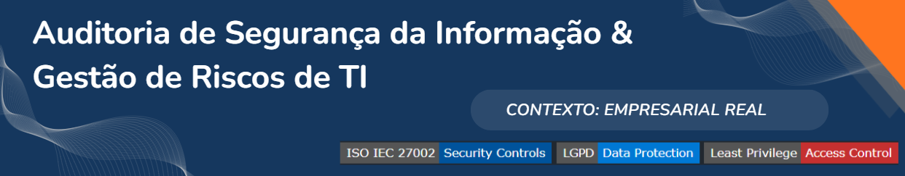

#### Auditoria de Segurança da Informação e Gestão de Riscos de TI

  
  
Avaliação prática da efetividade de controles de segurança, mapeamento de ativos críticos e estruturação de planos de mitigação alinhados à ISO 27002 e LGPD em contexto empresarial real.

#### **Natureza:** Acadêmico / Empresarial Real ✔

---

## Visão Geral

Este projeto consistiu na execução de uma auditoria técnica e processual de Segurança da Informação, com foco em processos e ativos relacionados ao departamento de Recursos Humanos de uma organização de grande porte. O trabalho avaliou a implementação e efetividade dos controles de segurança, mapeou ativos críticos e identificou riscos residuais, culminando na entrega de um plano de mitigação estruturado, alinhado às melhores práticas da ISO/IEC 27002 e da LGPD.

## Contexto e Problema

A organização necessitava de maior visibilidade sobre sua superfície de ataque e a efetividade real dos controles de segurança aplicados ao tratamento de dados pessoais relacionados aos colaboradores. Havia uma lacuna entre a conformidade documental e a postura técnica real, exigindo uma avaliação que unisse a auditoria de processos a testes técnicos controlados para identificar vulnerabilidades de forma precisa e acionável.

## Objetivos

- Mapear, classificar e valorar ativos críticos de informação (ex: dados pessoais, folha de pagamento, contratos).
- Avaliar a implementação e efetividade dos controles de segurança da informação com base na ISO 27002.
- Identificar vulnerabilidades técnicas e riscos residuais por meio de reconhecimento de rede e análise controlada.
- Propor um plano estratégico de mitigação e um programa de conscientização de colaboradores.

## Escopo

**Inclusões:** Infraestrutura de TI corporativa, processos críticos de RH, reconhecimento de rede (footprinting) e auditoria de conformidade.  
**Exclusões:** Sistemas legados de manufatura isolados da rede corporativa (OT) e testes destrutivos (ex: DoS).  
**Limites:** Projeto executado com prazo definido, sob premissa de análise em ambiente controlado e com dados sanitizados para fins de portfólio.

## Papel e Responsabilidades

Liderança técnica e metodológica do trabalho, abrangendo o levantamento e valoração de ativos, execução da avaliação de riscos, condução da análise de vulnerabilidades com ferramentas de varredura e elaboração dos relatórios técnico e executivo para a gestão.

## Metodologia e Abordagem

O projeto foi conduzido em fases estruturadas:
1. **Levantamento e Valoração de Ativos:** Mapeamento de ativos de informação e classificação baseada nos critérios de Disponibilidade, Integridade e Confidencialidade (D-I-C).
2. **Avaliação de Riscos:** Aplicação de metodologia de avaliação de riscos qualitativa, complementada por critérios de valoração de impacto para construção do Mapa de Calor (Heat Map).
3. **Auditoria de Conformidade:** Verificação da aderência dos controles implementados em relação aos requisitos da ISO/IEC 27002 e LGPD.
4. **Validação Técnica:** Execução de reconhecimento de rede (footprinting) e análise de configurações de hardening.
5. **Modelagem de Cenários de Incidentes:** Análise de cenários como ransomware via typosquatting e exploração de vulnerabilidades web para avaliar lacunas de controle e capacidade de resposta.
6. **Tratamento do Risco:** Elaboração do plano de melhoria contínua e definição de ações corretivas.

## Frameworks e Boas Práticas
<!-- Opcao 2: Estilo "flat-square" (Compacto e minimalista) -->

- **ISO/IEC 27002:** Utilizado como lista de verificação base para a auditoria de conformidade dos controles de segurança da informação.
- **LGPD (Lei Geral de Proteção de Dados):** Aplicado como requisito normativo para a classificação e proteção de dados pessoais relacionados aos colaboradores.
- **Princípio do Menor Privilégio:** Diretriz central aplicada na análise de acessos e nas recomendações de hardening.

## Tecnologias e Ferramentas

<!-- Opcao 2: Estilo "flat-square" (Compacto e minimalista) -->

- **Análise e Reconhecimento:** NMAP, MxToolbox e ferramentas de reconhecimento de superfície de ataque (utilizadas estritamente para análise de exposição pública autorizada e dentro do escopo definido).
- **Documentação e Modelagem:** Ferramentas de diagramação de topologia e planilhas de matriz de risco e valoração de ativos.

## Solução e Arquitetura

A solução entregue foi um modelo de avaliação de risco híbrido. Ele combinou a auditoria documental (baseada na ISO 27002) com a validação técnica. Os resultados foram consolidados em um Mapa de Calor (Heat Map) visual, que traduziu vulnerabilidades técnicas complexas em níveis de risco (Baixo, Médio, Alto, Crítico) compreensíveis para a tomada de decisão da alta gestão.

## Evidências e Entregáveis

- **Inventário e Valoração de Ativos:** Documento de classificação de ativos críticos com pontuação D-I-C.
- **Mapa de Calor (Heat Map):** Matriz de riscos qualitativa posicionando ativos críticos conforme sua valoração de impacto.
- **Relatório Técnico de Auditoria (Sanitizado):** Documentação dos achados identificados no escopo da avaliação, incluindo lacunas de proteção de endpoints, exposição de serviços e recomendações de hardening.
- **Plano de Melhoria e Mitigação:** Plano de ação estruturado com recomendações para atualização de servidores, implementação de controles e programa de conscientização.

*[Espaço reservado para inserção de imagens do Heat Map sanitizado, trechos do relatório técnico anonimizado ou diagrama de topologia de laboratório]*

## Resultados e Validação

- Mapeamento da superfície de ataque dentro do escopo definido e dos ativos críticos identificados.
- Identificação de lacunas de governança e proposição de um plano de tratamento estruturado para mitigação das vulnerabilidades mapeadas durante o estudo.
- Aprovação do plano estratégico de mitigação e início da estruturação do programa de auditorias periódicas e conscientização.

## Aprendizados e Limitações

- **Aprendizado:** A combinação de auditoria de conformidade com testes técnicos controlados fornece uma visão muito mais realista e acionável do risco residual do que a auditoria puramente documental.
- **Limitação:** A auditoria pontual representa um "retrato" do momento. Ficou evidente que a mitigação real e a manutenção da postura de segurança exigem monitoramento contínuo e automatizado, não apenas ações corretivas pontuais.

## Próximos Passos e Evoluções Futuras

- Integração dos achados e indicadores de risco a dashboards de GRC para monitoramento contínuo da postura de_security.
- Expansão do escopo de testes para incluir avaliações de engenharia social e auditoria de segurança de terceiros (TPRM).

---

## 📂 Documentação, Evidências e Recursos

- [Link para a Apresentação Executiva do Projeto (Sanitizada)]
- [Link para o Relatório Técnico de Auditoria (Anonimizado)]
- [Link para o Modelo de Mapa de Calor (Heat Map) e Valoração de Ativos]

---
## Contato

---

## 🧭 Navegação do Portfólio

[⬅️ Voltar ao Perfil Principal](https://github.com/mighcruz) 

[📂 Voltar ao Hub Central de Projetos](https://github.com/mighcruz/portfolio-ti)

---

###### 🔒 Nota de Confidencialidade

###### *Tratando-se de um projeto desenvolvido em ambiente de simulação corporativa e laboratório de testes, quaisquer topologias de rede, endereços IP, credenciais de acesso ou configurações específicas mencionadas na documentação original foram omitidas ou sanitizadas neste repositório, preservando as boas práticas de segurança da informação.*
